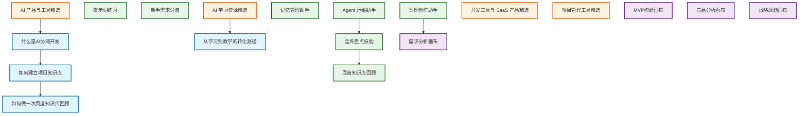

# 🕸️ 知识图谱 · Knowledge Graph

> 自动生成，用于可视化 Topic / Skill / Resource / Template 之间的关联关系。

## 图例

- 🔵 Topic
- 🟢 Skill
- 🟠 Resource
- 🟣 Template

## 说明

当前图谱仍是轻量版，后续可继续扩大：

1. 增加更多 Topic/Skill 节点
2. 从文档中的 Markdown 链接自动提取边
3. 生成按主题分区的子图谱

## 配套导航

如果你想从不同入口理解这张图谱，可以配合以下文档使用：

- [README](../README.md) ：从项目总说明进入，再回到结构图谱
- [START-HERE](../START-HERE.md) ：从新手入口进入，再回到结构图谱
- [场景-Skill 映射表](../Maps/场景-Skill%20映射表.md) ：从使用场景反推可调用技能
- [案例索引](../Maps/案例索引.md) ：从真实案例切入，再回到图谱理解结构
- [AI-Skill-System 导航](../Maps/AI-Skill-System%20导航.md) ：查看外部 Skill 体系与本库的连接点

## 当前统计快照

> 以下数字用于帮助用户快速理解当前图谱所代表的内容规模。

- `Skills/`：16 个文件
- `Maps/`：4 个文件
- `QCM/`：核心理论与研究成果
- `Systems/`：AI Skill 体系与家族定义
- `Platform/`：数据库、标准与注册中心

这些数字代表的是当前已纳入图谱理解范围的核心资产规模，不包含脚本、归档、数据库迁移记录等运维层文件。

## 标签

#导航 #知识图谱 #可视化
